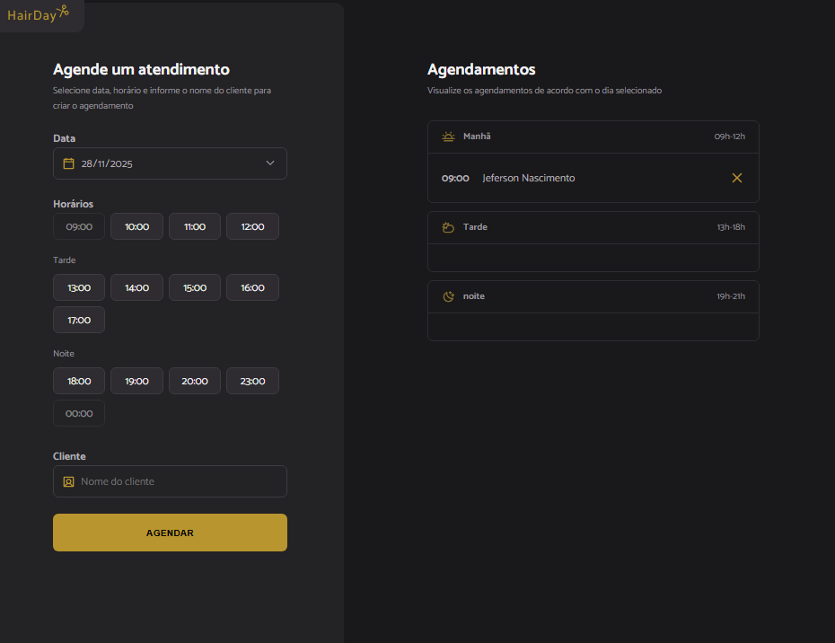

# HairDay -- Sistema de Agendamentos

Interface para gerenciamento de horários e agendamentos de um salão.\
Projeto criado com HTML, CSS, JavaScript e JSON Server como API fake.

------------------------------------------------------------------------

## 🚀 Funcionalidades

-   Seleção de data
-   Exibição de horários disponíveis por período (manhã, tarde e noite)
-   Registro de agendamentos
-   Remoção de agendamento
-   Atualização automática da lista ao selecionar outra data
-   API fake utilizando **json-server**

------------------------------------------------------------------------

## 📂 Estrutura de Pastas

    src/
     ├── assets/
     ├── js/
     ├── libs/
     ├── modules/
     │    ├── form/
     │    │    ├── data-change.js
     │    │    ├── hours-click.js
     │    │    ├── hours-load.js
     │    │    ├── submit.js
     │    │
     │    ├── schedules/
     │    │    ├── load.js
     │    │    ├── show.js
     │    │
     │    ├── page-load.js
     │
     ├── services/
     │    ├── api-config.js
     │    ├── schedule-fetch.js
     │    ├── scheduleNew.js
     │
     ├── styles/
     └── utils/
          ├── opening-hours.js
          ├── index.js

------------------------------------------------------------------------

## 🛠️ Instalação

### 1. Instale as dependências

``` bash
npm install
```

### 2. Instale o **json-server**

**Instalação local:**

``` bash
npm install json-server --save-dev
```

------------------------------------------------------------------------

## ▶️ Executar API Fake

Usando o script configurado no `package.json`:

``` json
"server": "json-server --watch server.json --port 3333"
```

Execute:

``` bash
npm run server
```

A API ficará disponível em:

    http://localhost:3333

### Endpoints principais:

-   Listar agendamentos:

```{=html}
<!-- -->
```
    GET /schedules

-   Buscar agendamento por ID:

```{=html}
<!-- -->
```
    GET /schedules/:id

------------------------------------------------------------------------

## ⚠️ Atenção com IDs numéricos

O **json-server** trata IDs numéricos e strings de forma diferente.\
Se seu ID for muito grande, use string:

``` json
{
  "id": "1764207610537"
}
```

------------------------------------------------------------------------

## 📸 Preview



------------------------------------------------------------------------

## 📄 Licença

Projeto livre para estudos.
